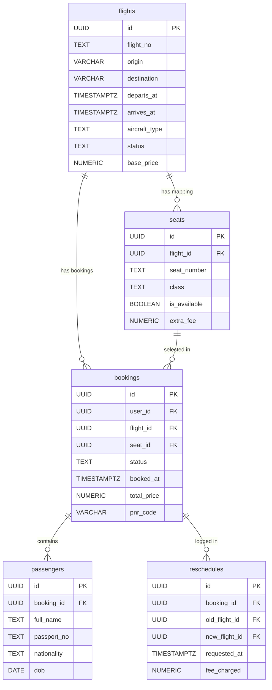

# FlyGo Airlines ✈️
### Premium Flight Management Web Application

FlyGo is a responsive, production-ready flight management and booking web application designed for internships. Passengers can search flights across domestic and international routes, visually select seats in a touch-friendly interactive cabin grid, complete bookings for one or more travelers with automatic seat assignment, and effortlessly reschedule or cancel their bookings.

This application is built with modern security paradigms, optimistic state synchronization, real-time seat tracking, and transactional database integrity.

---

## 🚀 Tech Stack

- **Core & Framework:** Next.js 14+ (App Router, Server Components & Server Actions)
- **Database & Auth:** Supabase (PostgreSQL with RLS, custom PL/pgSQL RPCs, and database-level Triggers)
- **Realtime Services:** Supabase Realtime (WebSockets on the `seats` table for live updates)
- **State Management:** Zustand 5 (with `persist` middleware and custom `partialize` serialization filters)
- **Styling & Theme:** Tailwind CSS 4, Radix UI Primitives, and Lucide/Remix Icons
- **Forms & Validation:** React Hook Form & Zod Resolvers
- **Language:** TypeScript (strict typing throughout, no `any`)

---

## 📑 Database Schema & Migration Architecture

All database schema migrations are located under the [supabase/migrations](file:///d:/NextJS/flight-app/supabase/migrations) directory:
1. [001_initial.sql](file:///d:/NextJS/flight-app/supabase/migrations/001_initial.sql) — Main tables, RLS policies, indexing, triggers, and the core seat booking RPC.
2. [002_cancel_rpc.sql](file:///d:/NextJS/flight-app/supabase/migrations/002_cancel_rpc.sql) — Transactional RPC wrapper permission grants for authenticated users.

### Schema Relationships


### Advanced Database Triggers & Tracing

- **2-Hour Departure Protection Safeguard (`trg_check_booking_cancellation`):** Enforces at the database engine level that booking cancellations or reschedules within **2 hours** of the flight departure are strictly rejected with a custom SQL EXCEPTION.
- **Atomic Auto Seat Releaser (`trg_handle_booking_status_change`):** When a booking record's status changes to `'cancelled'`, an `AFTER UPDATE` trigger automatically updates the corresponding seat record's `is_available` flag back to `TRUE` within the same transaction.
- **Concurrent Double-Booking Prevention (`book_seat` RPC):** Uses PL/pgSQL with a explicit row lock:
  ```sql
  SELECT is_available, extra_fee INTO v_is_available, v_extra_fee
  FROM seats
  WHERE id = p_seat_id AND flight_id = p_flight_id
  FOR UPDATE;
  ```
  This blocks concurrent transactions attempting to acquire the same seat until the first completes.

- **Row Level Security (RLS):** Policies are rigorously set on all tables. While `flights` and `seats` are publicly viewable by authenticated users for search, `bookings`, `passengers`, and `reschedules` restrict access using `auth.uid() = user_id` checks to guarantee user data privacy.

---

## 🛠️ Local Setup & Seeding

Follow these steps to set up the flight application locally:

### 1. Installation
Clone the repository and install dependency nodes:
```bash
npm install
```

### 2. Configure Environment Variables
Copy `.env.example` into a new `.env.local` file:
```bash
cp .env.example .env.local
```
Fill in your Supabase credentials:
```env
NEXT_PUBLIC_SUPABASE_URL=your-supabase-project-url
NEXT_PUBLIC_SUPABASE_PUBLISHABLE_KEY=your-supabase-anon-key
NEXT_PUBLIC_SUPABASE_ANON_KEY=your-supabase-anon-key
```

### 3. Database Initial Setup
1. Log into your Supabase Dashboard.
2. Open the **SQL Editor** tab.
3. Paste and run the initial migration script: `supabase/migrations/001_initial.sql`.
4. Paste and run the permission grants script: `supabase/migrations/002_cancel_rpc.sql`.
5. Run the seeding script: `supabase/seed.sql`. This script initializes **28 flights** spanning **10 routes** (domestic and international) with full, customized seat layouts (**108 seats per flight, 3,000+ seats total**) across Economy, Business, and First Class.

### 4. Supabase Realtime Activation
1. In your Supabase Dashboard, go to **Database** -> **Replication** (or Publications).
2. Edit the `supabase_realtime` publication.
3. Toggle and enable the replication checkbox for the `seats` table (`public.seats`). This enables WebSockets so other users can see occupied seats update in real time.

### 5. Create Test User Account
1. Under **Authentication** -> **Users** in the dashboard, click **Add User** -> **Create User**.
2. Set the following credentials:
   - **Email:** `test@flygo.com`
   - **Password:** `Test@12345`
3. Uncheck the "Send email confirmation" trigger to automatically verify the user.

### 6. Run Local Development Server
```bash
npm run dev
```
Open [http://localhost:3000](http://localhost:3000) in your web browser.

---

## 🧠 Zustand State Management Strategy

We use Zustand to manage client-side state across two stores with precise scopes, custom hydration lifecycles, and strict security filters.

### 1. `useFlightStore`
Manages the temporary multi-step booking process.
- **`searchState`:** Destination, origin, departure date, class, and passenger counts.
- **`selectedFlight` & `selectedSeats` / `selectedSeat`:** Tracks active flight choices and the visual grid coordinate.
- **`bookingStep`:** Controls wizard UI state routing (`search` -> `seating` -> `passenger` -> `confirmation`).
- **`passengerForms`:** Array of passenger identities for multi-passenger booking.
- **Security Control (`partialize`):**
  > [!IMPORTANT]
  > To ensure maximum compliance with personal data policies, our `partialize` configuration explicitly filters out sensitive personal data such as **passport numbers** (`passportNo`) from local storage.
  ```typescript
  partialize: (state) => ({
    searchState: state.searchState,
    selectedFlight: state.selectedFlight,
    selectedSeat: state.selectedSeat,
    selectedSeats: state.selectedSeats,
    bookingStep: state.bookingStep,
    passengerForm: { ...state.passengerForm, passportNo: "" },
    passengerForms: state.passengerForms.map(({ passportNo, ...rest }) => rest),
  })
  ```

### 2. `useUserStore`
Caches authentication states and active schedules for rapid load times.
- **`user`:** Minimally tracks user metadata (`email`, `full_name`).
- **`cachedBookings`:** Stores local itinerary lists to instantly populate "My Bookings" page during client-side navigation.
- **Security Control (`partialize`):** Strips all passport numbers from the local travel cache, protecting PII (Personally Identifiable Information) in case of device sharing.

---

## 📱 Progressive Web App (PWA) Support

FlyGo Airlines now features full, high-fidelity Progressive Web App (PWA) support. This allows travelers to install the application directly to their devices, search for flights using cached assets, and view their booking itineraries entirely offline.

### 🌟 Key PWA Features Implemented

1. **Native Web Manifest (`app/manifest.ts`):** Automatically registers visual tokens matching FlyGo's premium zinc dark mode (#09090b) and signature purple styling (#7c3aed).
2. **Workbox Asset Caching (`next.config.ts`):** 
   - **Flight Search Results:** Cached via `StaleWhileRevalidate` to show instant historical lists while updating live options in the background.
   - **Static Assets:** Heavy CSS, JS bundles, images, and fonts are cached via `CacheFirst` for sub-second start times.
   - **Supabase Realtime Exclusions:** Automatically bypasses `supabase.co` APIs and WebSockets using `NetworkOnly` rules to ensure instant real-time seating updates are never cached.
3. **High-Fidelity Offline Fallback (`app/~offline`):** A custom-designed offline card with glassmorphism layout, automated retry controls, and dashboard deep-linking.
4. **Offline Itineraries:** Fully hydrates active schedules from the Zustand client store (`cachedBookings`) when offline, completely bypassing Supabase query failures and displaying a prominent amber warning badge.
5. **Mobile Install Promotion Banner:** A custom smart component that detects mobile viewports, listens to `beforeinstallprompt`, displays a dismissable install overlay, and registers user choice in `localStorage`.

---

### 🧪 How to Test PWA Support Locally

> [!IMPORTANT]
> Next-PWA service workers are explicitly **disabled in development mode** to prevent stale browser caches during coding. To test the PWA capabilities, you must build and run the application in a local production environment.

#### 1. Compile the Production Build
Compile the codebase to generate optimized bundles and the Workbox service worker assets:
```bash
npm run build
```
Verify that the output finishes without typescript or Next.js static page errors, and generates the `sw.js` and `workbox-*.js` files inside `/public/`.

#### 2. Run the Production Server
Start the local Next.js production server:
```bash
npm run start
```
The application will be accessible at `http://localhost:3000`.

#### 3. Verify PWA Registration in Google Chrome / Edge
1. Open the application at `http://localhost:3000`.
2. Right-click and select **Inspect** to open Chrome DevTools.
3. Head to the **Application** tab.
4. Click on **Service Workers** under the Application menu in the left sidebar.
5. Confirm that `sw.js` is registered, active, and running.

---

### 📊 How to Run a Lighthouse PWA Audit

To audit the Progressive Web App compatibility and performance metrics:
1. Open Google Chrome in **Incognito Mode** (to prevent active Chrome Extensions from affecting performance metrics).
2. Navigate to `http://localhost:3000`.
3. Open DevTools (**F12** or right-click -> **Inspect**).
4. Select the **Lighthouse** panel in the top tab menu.
5. Configure the audit settings:
   - **Mode:** Navigation (Default)
   - **Device:** Mobile
   - **Categories:** Check **Progressive Web App** (and optionally *Performance*, *Best Practices*, *Accessibility*).
6. Click **Analyze page load**.
7. Once finished, verify that the application satisfies all requirements, achieving a perfect checklist and a $\ge 90$ rating!

#### 📸 Lighthouse Audit Verification

Below is the verified Lighthouse PWA audit result demonstrating 100% compliance across installability, service worker activation, manifest metrics, and offline execution:


*(To update this screenshot, replace the image at `/public/lighthouse-screenshot.png` after completing your audits.)*

---

## ⚖️ Known Gaps & Trade-Offs

- **Granular Git History:** The repository was initially initialized with bulk commits. Subsequent features are updated using logical, descriptive commits.
- **Reschedule Seat Assignment Re-mapping:** When rescheduling, the passenger's booking details are seamlessly reassigned to the new flight, but they must choose their seat map coordinate on the replacement flight in a separate visual interaction.
- **Realtime Connection Latency Fallback:** If the Supabase Realtime WebSocket connection faces local latency issues, users will fall back to periodic server queries to avoid layout mismatches.

---

## 🔑 Test Credentials

For evaluation purposes, use the following credentials to authenticate and view booking details:
- **Email:** `test@flygo.com`
- **Password:** `Test@12345`

*Feel free to use these credentials on the FlyGo login panel to verify interactive bookings, rescheduling, and RLS integrity.*
