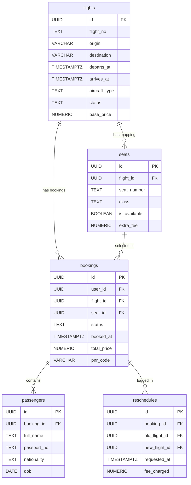

# FlyGo Airlines ✈️
### Premium Flight Management Web Application

FlyGo is a responsive, production-ready flight management and booking web application designed for internships. Passengers can search flights across domestic and international routes, visually select seats in a touch-friendly interactive cabin grid, complete bookings for one or more travelers with automatic seat assignment, and effortlessly reschedule or cancel their bookings.

This application is built with modern security paradigms, optimistic state synchronization, real-time seat tracking, and transactional database integrity.

---

## 🚀 Tech Stack

- **Core & Framework:** Next.js 14+ (App Router, Server Components & Server Actions)
- **Database & Auth:** Supabase (PostgreSQL with RLS, custom PL/pgSQL RPCs, and database-level Triggers)
- **Realtime Services:** Supabase Realtime (WebSockets on the `seats` table for live updates)
- **State Management:** Zustand 5 (with `persist` middleware and custom `partialize` serialization filters)
- **Styling & Theme:** Tailwind CSS 4, Radix UI Primitives, and Lucide/Remix Icons
- **Forms & Validation:** React Hook Form & Zod Resolvers
- **Language:** TypeScript (strict typing throughout, no `any`)

---

## 📑 Database Schema & Migration Architecture

All database schema migrations are located under the [supabase/migrations](file:///d:/NextJS/flight-app/supabase/migrations) directory:
1. [001_initial.sql](file:///d:/NextJS/flight-app/supabase/migrations/001_initial.sql) — Main tables, RLS policies, indexing, triggers, and the core seat booking RPC.
2. [002_cancel_rpc.sql](file:///d:/NextJS/flight-app/supabase/migrations/002_cancel_rpc.sql) — Transactional RPC wrapper permission grants for authenticated users.

### Schema Relationships


### Advanced Database Triggers & Tracing

- **2-Hour Departure Protection Safeguard (`trg_check_booking_cancellation`):** Enforces at the database engine level that booking cancellations or reschedules within **2 hours** of the flight departure are strictly rejected with a custom SQL EXCEPTION.
- **Atomic Auto Seat Releaser (`trg_handle_booking_status_change`):** When a booking record's status changes to `'cancelled'`, an `AFTER UPDATE` trigger automatically updates the corresponding seat record's `is_available` flag back to `TRUE` within the same transaction.
- **Concurrent Double-Booking Prevention (`book_seat` RPC):** Uses PL/pgSQL with a explicit row lock:
  ```sql
  SELECT is_available, extra_fee INTO v_is_available, v_extra_fee
  FROM seats
  WHERE id = p_seat_id AND flight_id = p_flight_id
  FOR UPDATE;
  ```
  This blocks concurrent transactions attempting to acquire the same seat until the first completes.

- **Row Level Security (RLS):** Policies are rigorously set on all tables. While `flights` and `seats` are publicly viewable by authenticated users for search, `bookings`, `passengers`, and `reschedules` restrict access using `auth.uid() = user_id` checks to guarantee user data privacy.

---

## 🛠️ Local Setup & Seeding

Follow these steps to set up the flight application locally:

### 1. Installation
Clone the repository and install dependency nodes:
```bash
npm install
```

### 2. Configure Environment Variables
Copy `.env.example` into a new `.env.local` file:
```bash
cp .env.example .env.local
```
Fill in your Supabase credentials:
```env
NEXT_PUBLIC_SUPABASE_URL=your-supabase-project-url
NEXT_PUBLIC_SUPABASE_PUBLISHABLE_KEY=your-supabase-anon-key
NEXT_PUBLIC_SUPABASE_ANON_KEY=your-supabase-anon-key
```

### 3. Database Initial Setup
1. Log into your Supabase Dashboard.
2. Open the **SQL Editor** tab.
3. Paste and run the initial migration script: `supabase/migrations/001_initial.sql`.
4. Paste and run the permission grants script: `supabase/migrations/002_cancel_rpc.sql`.
5. Run the seeding script: `supabase/seed.sql`. This script initializes **28 flights** spanning **10 routes** (domestic and international) with full, customized seat layouts (**108 seats per flight, 3,000+ seats total**) across Economy, Business, and First Class.

### 4. Supabase Realtime Activation
1. In your Supabase Dashboard, go to **Database** -> **Replication** (or Publications).
2. Edit the `supabase_realtime` publication.
3. Toggle and enable the replication checkbox for the `seats` table (`public.seats`). This enables WebSockets so other users can see occupied seats update in real time.

### 5. Create Test User Account
1. Under **Authentication** -> **Users** in the dashboard, click **Add User** -> **Create User**.
2. Set the following credentials:
   - **Email:** `test@flygo.com`
   - **Password:** `Test@12345`
3. Uncheck the "Send email confirmation" trigger to automatically verify the user.

### 6. Run Local Development Server
```bash
npm run dev
```
Open [http://localhost:3000](http://localhost:3000) in your web browser.

---

## 🧠 Zustand State Management Strategy

We use Zustand to manage client-side state across two stores with precise scopes, custom hydration lifecycles, and strict security filters.

### 1. `useFlightStore`
Manages the temporary multi-step booking process.
- **`searchState`:** Destination, origin, departure date, class, and passenger counts.
- **`selectedFlight` & `selectedSeats` / `selectedSeat`:** Tracks active flight choices and the visual grid coordinate.
- **`bookingStep`:** Controls wizard UI state routing (`search` -> `seating` -> `passenger` -> `confirmation`).
- **`passengerForms`:** Array of passenger identities for multi-passenger booking.
- **Security Control (`partialize`):**
  > [!IMPORTANT]
  > To ensure maximum compliance with personal data policies, our `partialize` configuration explicitly filters out sensitive personal data such as **passport numbers** (`passportNo`) from local storage.
  ```typescript
  partialize: (state) => ({
    searchState: state.searchState,
    selectedFlight: state.selectedFlight,
    selectedSeat: state.selectedSeat,
    selectedSeats: state.selectedSeats,
    bookingStep: state.bookingStep,
    passengerForm: { ...state.passengerForm, passportNo: "" },
    passengerForms: state.passengerForms.map(({ passportNo, ...rest }) => rest),
  })
  ```

### 2. `useUserStore`
Caches authentication states and active schedules for rapid load times.
- **`user`:** Minimally tracks user metadata (`email`, `full_name`).
- **`cachedBookings`:** Stores local itinerary lists to instantly populate "My Bookings" page during client-side navigation.
- **Security Control (`partialize`):** Strips all passport numbers from the local travel cache, protecting PII (Personally Identifiable Information) in case of device sharing.

---

## 📋 PWA Status & Implementation Roadmap

> [!WARNING]
> **Task 05 (PWA / Progressive Web App Setup) is NOT currently added to this build.**
> Below is the highly structured design blueprint, service worker caching strategy, and implementation roadmap planned to configure full offline support and achieve a $\ge 90$ rating in Lighthouse audits.

### 🗺️ PWA Future Roadmap

#### 1. Manifest Configuration (`/public/manifest.json`)
Add a valid web manifest file mapping basic options:
```json
{
  "name": "FlyGo Airlines",
  "short_name": "FlyGo",
  "description": "Premium real-time flight search and interactive seat booking app.",
  "start_url": "/",
  "display": "standalone",
  "background_color": "#09090b",
  "theme_color": "#7c3aed",
  "orientation": "portrait-primary",
  "icons": [
    {
      "src": "/icons/icon-192x192.png",
      "sizes": "192x192",
      "type": "image/png",
      "purpose": "any maskable"
    },
    {
      "src": "/icons/icon-512x512.png",
      "sizes": "512x512",
      "type": "image/png"
    }
  ]
}
```

#### 2. Caching Strategy Configuration with `next-pwa`
Configure the `next-pwa` plugin in `next.config.ts` to manage asset caches using Workbox:
- **`StaleWhileRevalidate` (Flight Search Results):** Checks cache first to render instant historical updates, while concurrently querying the Supabase server actions in the background to update with active schedules.
- **`CacheFirst` (Static Assets):** Caches heavy custom assets (like local high-fidelity hero slide images, fonts, styling bundles) locally in the cache to enable instant startup speeds.
```typescript
// Proposed next.config.ts update:
const withPWA = require("next-pwa")({
  dest: "public",
  disable: process.env.NODE_ENV === "development",
  register: true,
  skipWaiting: true,
  runtimeCaching: [
    {
      urlPattern: /^\/api\/flights.*/i,
      handler: "StaleWhileRevalidate",
      options: {
        cacheName: "flights-data-cache",
        expiration: { maxEntries: 32, maxAgeSeconds: 3600 }
      }
    },
    {
      urlPattern: /\.(?:js|css|woff2|png|jpg|jpeg|svg|ico)$/i,
      handler: "CacheFirst",
      options: {
        cacheName: "static-assets-cache",
        expiration: { maxEntries: 128, maxAgeSeconds: 86400 * 30 }
      }
    }
  ]
});
```

#### 3. Custom Offline Fallback Screen
An offline fallback page (`/src/app/~offline/page.tsx`) would be served by the service worker when connection drops, displaying a gorgeous visual message instructing the user to check their network connection, while keeping cached flight listings accessible.

#### 4. Read-Only Offline Bookings Page
By leveraging the **Zustand cache** (`useUserStore.cachedBookings`), the "My Bookings" page is designed to remain readable even when offline, rendering cached travel details immediately with custom offline badges.

#### 5. Native Installation Invite Banner
A custom browser utility script listening to `beforeinstallprompt` events will display a minimalist slide-in invitation banner at the top of the interface for mobile users, prompting them to add FlyGo directly to their home screens.

---

## ⚖️ Known Gaps & Trade-Offs

- **Granular Git History:** The repository was initially initialized with bulk commits. Subsequent features are updated using logical, descriptive commits.
- **Reschedule Seat Assignment Re-mapping:** When rescheduling, the passenger's booking details are seamlessly reassigned to the new flight, but they must choose their seat map coordinate on the replacement flight in a separate visual interaction.
- **Realtime Connection Latency Fallback:** If the Supabase Realtime WebSocket connection faces local latency issues, users will fall back to periodic server queries to avoid layout mismatches.

---

## 🔑 Test Credentials

For evaluation purposes, use the following credentials to authenticate and view booking details:
- **Email:** `test@flygo.com`
- **Password:** `Test@12345`

*Feel free to use these credentials on the FlyGo login panel to verify interactive bookings, rescheduling, and RLS integrity.*
