# Fly Go

A real-time flight booking app where users can search flights, pick seats from an interactive map, and manage bookings (including rescheduling and cancellations). It's built as an installable PWA that works offline.

---


---

| Info             | Details                                       |
| :--------------- | :-------------------------------------------- |
| Live Demo        | [Vercel](https://flight-app-self.vercel.app/) |
| Created by       | [Aarab Nishchal](https://aarab.vercel.app/)   |
| Creator's GitHub | [aarabii](https://github.com/aarabii)         |
| Contact Creator  | [Gmail](mailto:aarab.nishchal@gmail.com)      |

---

## Demo accounts

- **Email:** `test@test.com` (has dummy bookings and passenger history already populated for quick testing)
- **Email:** `fresh_test_user@test.com` (clean account with no booking history)
- **Password:** `12345678`

---

## Features

- **Flight search:** Live queries with cabin class filters and multi-passenger bookings.
- **Seat maps:** Interactive seat selector that calculates seat fees dynamically.
- **Booking dashboard:** Rescheduling and cancellations directly from your profile.
- **Offline PWA:** Fully installable desktop or mobile app with offline caching.
- **Authentication:** Secure sign-in and account registration via Supabase Auth.
- **Performance:** Fast load times with semantic markup and responsive layout styling.

---

## Tech stack

| Component      | Technology              |
| :------------- | :---------------------- |
| Frontend       | Next.js 16 (App Router) |
| Database       | Supabase                |
| Authentication | Supabase Auth           |
| Styling        | Tailwind CSS v4         |
| State          | Zustand                 |
| Deployment     | Vercel                  |
| Offline/PWA    | next-pwa                |

---

## Database schema

The backend runs on Supabase with five primary tables:

- **flights**: `id`, `flight_no`, `origin`, `destination`, `departs_at`, `arrives_at`, `aircraft_type`, `status`, `base_price`
- **seats**: `id`, `flight_id`, `seat_number`, `class` (economy/business/first), `is_available`, `extra_fee`
- **bookings**: `id`, `user_id`, `flight_id`, `seat_id`, `status`, `booked_at`, `total_price`, `pnr_code`
- **passengers**: `id`, `booking_id`, `full_name`, `passport_no`, `nationality`, `dob`
- **reschedules**: `id`, `booking_id`, `old_flight_id`, `new_flight_id`, `requested_at`, `fee_charged`

### ER diagram


---

## Database migrations

Three migrations in `supabase/migrations` handle the schema, security rules, and database functions:

1. [001_initial.sql](supabase/migrations/001_initial.sql): Sets up tables, relationships, and Row-Level Security (RLS) rules.
   - **Permissions:** Flight and seat tables are readable by anyone. Creating bookings or saving passenger data requires an authenticated user.
   - **Functions:** Handles automatic timestamp updates and basic helper scripts.

2. [002_cancel_rpc.sql](supabase/migrations/002_cancel_rpc.sql): Grants execute permissions for user-facing actions.
   - **RPCs:** Exposes safe `book_seat` and `cancel_booking` database functions to the frontend.

3. [003_booking_security_and_rpc_fixes.sql](supabase/migrations/003_booking_security_and_rpc_fixes.sql): Improves concurrency limits and security policies.
   - **Fixes:** Plugs potential double-refund exploits in `cancel_booking`, adds missing RLS policies for deleting bookings, and registers an atomic transaction for the `reschedule_booking` RPC.

---

## Database seeding

Use `supabase/seed.sql` to populate your local database with mock data:

- **Flights:** Generates routes across 10 airports for dates from May 20, 2026 to July 26, 2026.
- **Seat maps:** Generates 108 seats per flight (First, Business, Economy) with pricing modifiers based on class.
- **Occupied states:** Automatically marks one seat per flight as occupied so you can verify unavailable states in the interactive seat map.

---

## State management

We use Zustand to manage client-side state. The stores persist data across reloads, handle SSR hydration safely, and strip out sensitive data like passport numbers before saving to localStorage.

### 1. Flight store (`src/store/useFlightStore.ts`)

Manages the active search query, selected flight/seats, passenger details, and the checkout step.

#### State schema

| State Field      | Type              | Default Value | Description                                                                         |
| :--------------- | :---------------- | :------------ | :---------------------------------------------------------------------------------- |
| `searchState`    | `SearchState`     | See below     | Active flight query (origin, destination, date, class, passenger count)             |
| `selectedFlight` | `Flight \| null`  | `null`        | Chosen flight for booking                                                           |
| `selectedSeat`   | `Seat \| null`    | `null`        | Legacy single-seat reference                                                        |
| `selectedSeats`  | `Seat[]`          | `[]`          | Selected seats mapped to each passenger                                             |
| `bookingStep`    | `BookingStep`     | `"search"`    | Current step in checkout (`"search" \| "seating" \| "passenger" \| "confirmation"`) |
| `passengerForm`  | `PassengerForm`   | Empty fields  | Legacy single-passenger form fields                                                 |
| `passengerForms` | `PassengerForm[]` | `[Empty]`     | Dynamic list of passenger details                                                   |

- **Default `searchState`:**

  ```json
  {
    "origin": "",
    "destination": "",
    "date": "",
    "class": "economy",
    "passengerCount": 1
  }
  ```

#### Actions

- `setSearchState(search: Partial<SearchState>)`: Updates the search parameters.
- `setSelectedFlight(flight: Flight | null)`: Selects a flight.
- `setSelectedSeat(seat: Seat | null)`: Selects a seat and populates `selectedSeats` with it.
- `setSelectedSeats(seats: Seat[])`: Selects multiple seats and updates the single-seat fallback.
- `setBookingStep(step: BookingStep)`: Advances or rolls back checkout steps.
- `updatePassengerForm(form: Partial<PassengerForm>)`: Updates single passenger details.
- `setPassengerForms(forms: PassengerForm[])`: Updates details for all passengers.
- `resetBookingFlow()`: Clears seat/passenger selections and returns to `"seating"`.
- `resetAll()`: Wipes the store back to defaults.

#### Middleware and security

- **Persistence:** Saved under the `flygo-flight-storage` key in browser storage.
- **Privacy filter:** The `partialize` setting strips out `passportNo` from passenger profiles before writing to disk.

---

### 2. User store (`src/store/useUserStore.ts`)

Tracks user logins and caches booking history to support offline access.

#### State schema

| State Field      | Type                | Default Value | Description                                   |
| :--------------- | :------------------ | :------------ | :-------------------------------------------- |
| `user`           | `StoreUser \| null` | `null`        | Logged-in user details (`email`, `full_name`) |
| `cachedBookings` | `CachedBooking[]`   | `[]`          | Local cache/optimistic state of user bookings |

#### Actions

- `setUser(user: StoreUser | null)`: Sets logged-in user state.
- `setCachedBookings(bookings)`: Batch updates booking history.
- `addCachedBooking(booking: CachedBooking)`: Adds a new booking to the front of the cache.
- `updateCachedBookingStatus(bookingId, status)`: Alters booking status (`"confirmed" \| "cancelled" \| "rescheduled"`).
- `clearSession()`: Clears session state and cached bookings on logout.

#### Middleware and security

- **Persistence:** Saved under the `flygo-user-storage` key.
- **Privacy filter:** The `partialize` configuration recursively strips all `passport_no` and `passportNo` fields from cached passenger objects prior to browser serialization.

---

### 3. SSR hydration guard (`src/store/useStoreHydration.ts`)

A helper hook that prevents Next.js hydration mismatch errors when reading from client-side persisted stores.

#### Signature

```typescript
export function useStoreHydration<S, F>(
  store: UseBoundStore<StoreApi<S>>,
  selector: (state: S) => F,
): F | undefined;
```

#### Why it is needed

Since persisted Zustand stores read from `localStorage` on client load, the server-side markup won't match, causing hydration errors.

#### How it works

Returns `undefined` until the component mounts (`useEffect`), ensuring a clean client transition.

---

## Installation

Set up the project locally:

1. Clone the repository and install dependencies:

   ```bash
   git clone https://github.com/aarabii/flight-app
   cd flight-app
   npm install
   ```

2. Copy the environment template:

   ```bash
   cp .env.example .env.local
   ```

3. Add your Supabase credentials to `.env.local`:

   ```env
   NEXT_PUBLIC_SUPABASE_URL="your-supabase-url"
   NEXT_PUBLIC_SUPABASE_PUBLISHABLE_KEY="your-supabase-anon-key"
   ```

4. Start the server:
   ```bash
   npm run dev
   ```
   Open `http://localhost:3000` in your browser.

---

## Screenshots

Here is a quick look at the interface, setup prompts, and database security rules:

### Core views

<table width="100%">
  <tr>
    <td width="50%" align="center" valign="top">
      <strong>Desktop application view</strong>
      <br />
      <a href="./screenshots/desktop_screen_ss.png" target="_blank">
        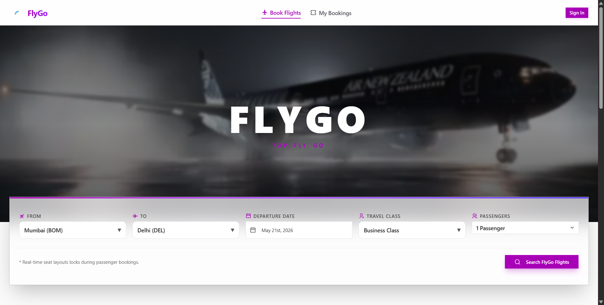
      </a>
      <br />
      <sub><em>Main desktop layout.</em></sub>
    </td>
    <td width="50%" align="center" valign="top">
      <strong>Full landing page</strong>
      <br />
      <a href="./screenshots/full_landing_page.png" target="_blank">
        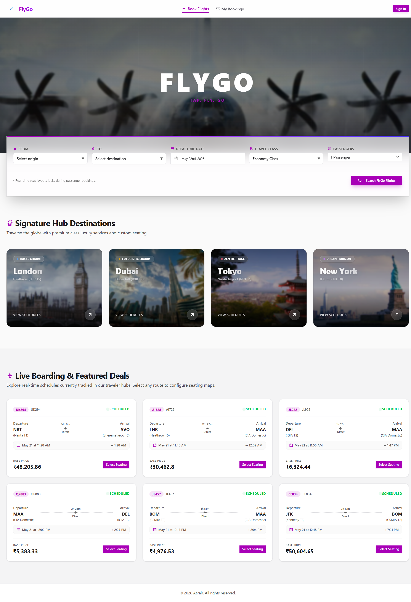
      </a>
      <br />
      <sub><em>Full scroll layout.</em></sub>
    </td>
  </tr>
  <tr>
    <td width="50%" align="center" valign="top">
      <strong>Flight search screen</strong>
      <br />
      <a href="./screenshots/search_page.png" target="_blank">
        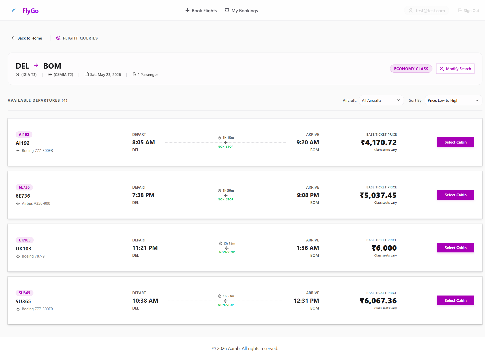
      </a>
      <br />
      <sub><em>Flight search inputs.</em></sub>
    </td>
    <td width="50%" align="center" valign="top">
      <strong>Seat selection map</strong>
      <br />
      <a href="./screenshots/seat_selection_option.png" target="_blank">
        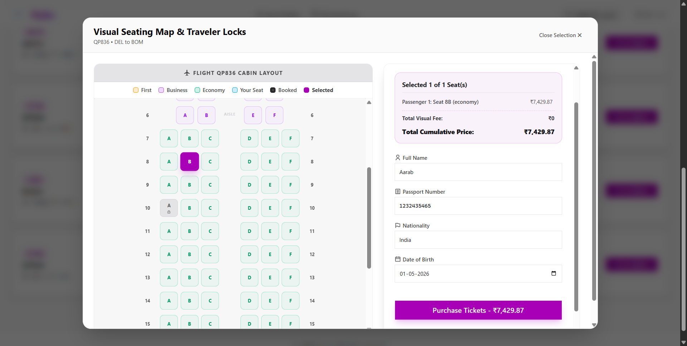
      </a>
      <br />
      <sub><em>Interactive seat map by cabin class.</em></sub>
    </td>
  </tr>
  <tr>
    <td width="50%" align="center" valign="top">
      <strong>Booking details and checkout</strong>
      <br />
      <a href="./screenshots/booking_page.png" target="_blank">
        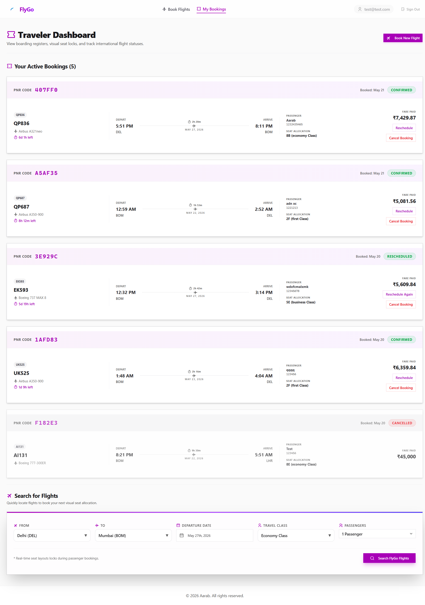
      </a>
      <br />
      <sub><em>Passenger input and pricing details.</em></sub>
    </td>
    <td width="50%" align="center" valign="top">
      <strong>Booking confirmation card</strong>
      <br />
      <a href="./screenshots/booking_confirmaation_card.png" target="_blank">
        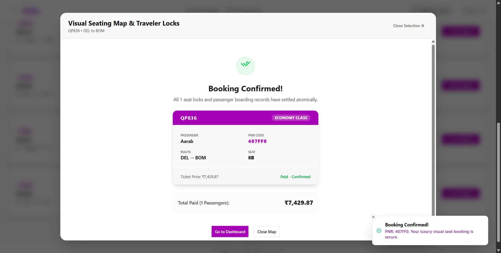
      </a>
      <br />
      <sub><em>Completed reservation receipt.</em></sub>
    </td>
  </tr>
  <tr>
    <td width="50%" align="center" valign="top">
      <strong>Flight rescheduling screen</strong>
      <br />
      <a href="./screenshots/reschedule_page.png" target="_blank">
        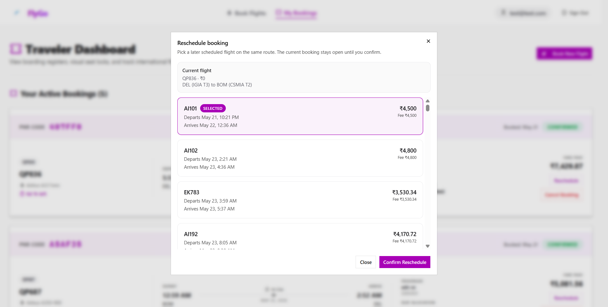
      </a>
      <br />
      <sub><em>Flight swap interface.</em></sub>
    </td>
    <td width="50%" align="center" valign="top">
      <strong>User login screen</strong>
      <br />
      <a href="./screenshots/login_page.png" target="_blank">
        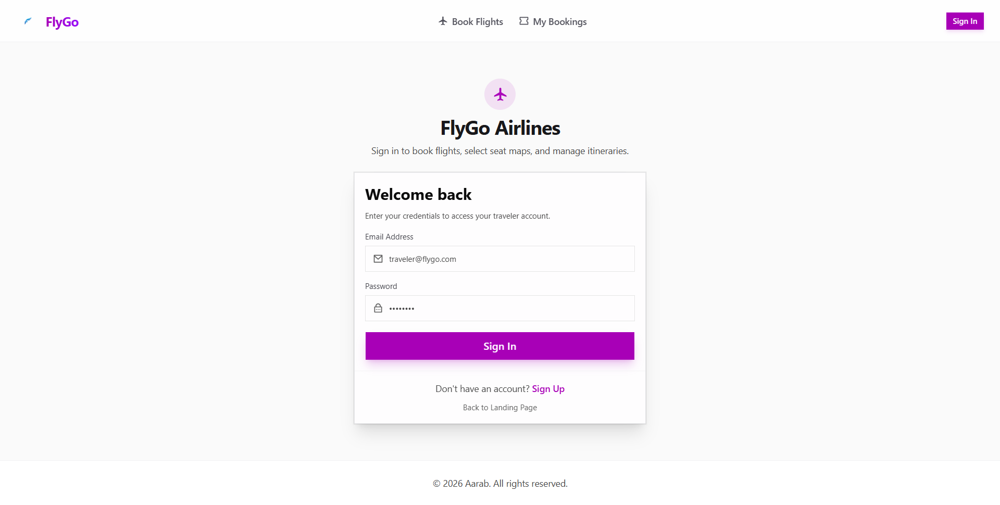
      </a>
      <br />
      <sub><em>Sign-in interface.</em></sub>
    </td>
  </tr>
</table>

### Dialogs and notifications

<table width="100%">
  <tr>
    <td width="50%" align="center" valign="top">
      <strong>Cancellation warning prompt</strong>
      <br />
      <a href="./screenshots/popup_before_cancelation.png" target="_blank">
        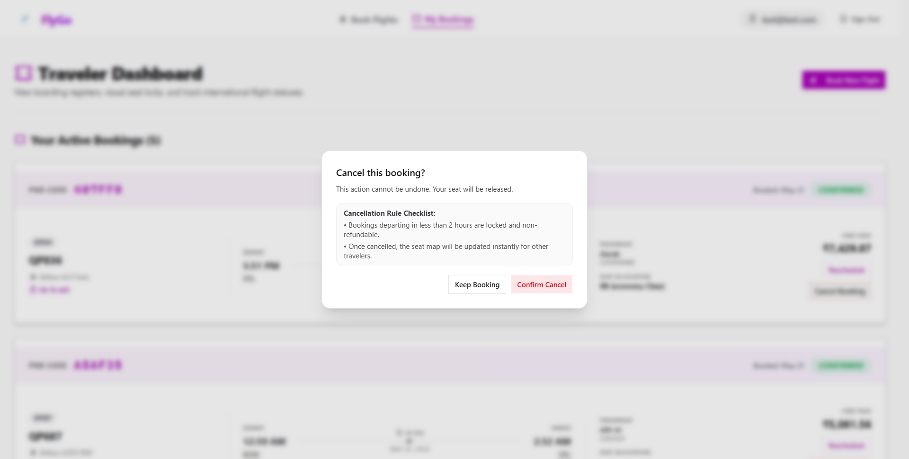
      </a>
      <br />
      <sub><em>Cancellation confirmation check.</em></sub>
    </td>
    <td width="50%" align="center" valign="top">
      <strong>Cancellation not allowed warning</strong>
      <br />
      <a href="./screenshots/cancelation_not_allowed_toast.png" target="_blank">
        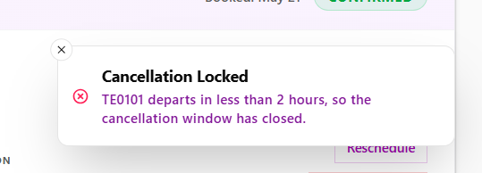
      </a>
      <br />
      <sub><em>Validation warning for restricted cancellation.</em></sub>
    </td>
  </tr>
</table>

### Progressive Web App (PWA) install flow

<table width="100%">
  <tr>
    <td width="50%" align="center" valign="top">
      <strong>PWA installation callout</strong>
      <br />
      <a href="./screenshots/popup_to_install_pwa.png" target="_blank">
        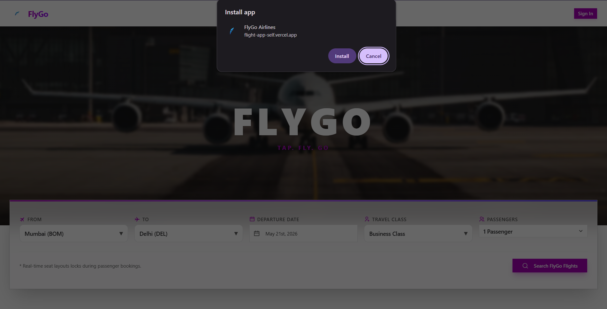
      </a>
      <br />
      <sub><em>App install banner.</em></sub>
    </td>
    <td width="50%" align="center" valign="top">
      <strong>Install option promotion</strong>
      <br />
      <a href="./screenshots/option_to_open_as_app.png" target="_blank">
        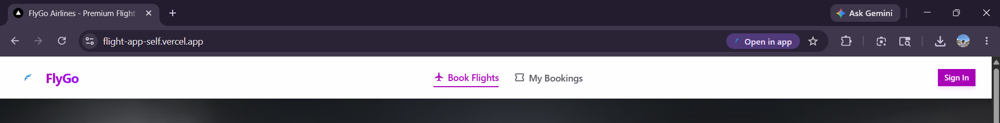
      </a>
      <br />
      <sub><em>Browser address-bar open option.</em></sub>
    </td>
  </tr>
  <tr>
    <td width="50%" align="center" valign="top">
      <strong>PWA installation prompt</strong>
      <br />
      <a href="./screenshots/pwa_popup.png" target="_blank">
        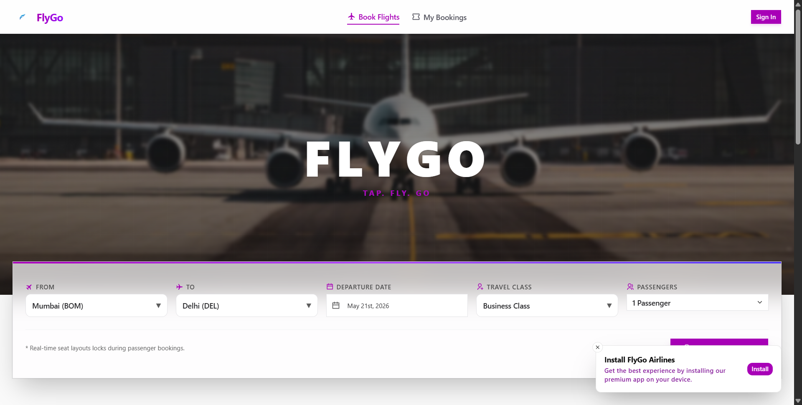
      </a>
      <br />
      <sub><em>Popup notification to open install prompt.</em></sub>
    </td>
    <td width="50%" align="center" valign="top">
      <strong>Running as standalone native PWA</strong>
      <br />
      <a href="./screenshots/opened_as_app.png" target="_blank">
        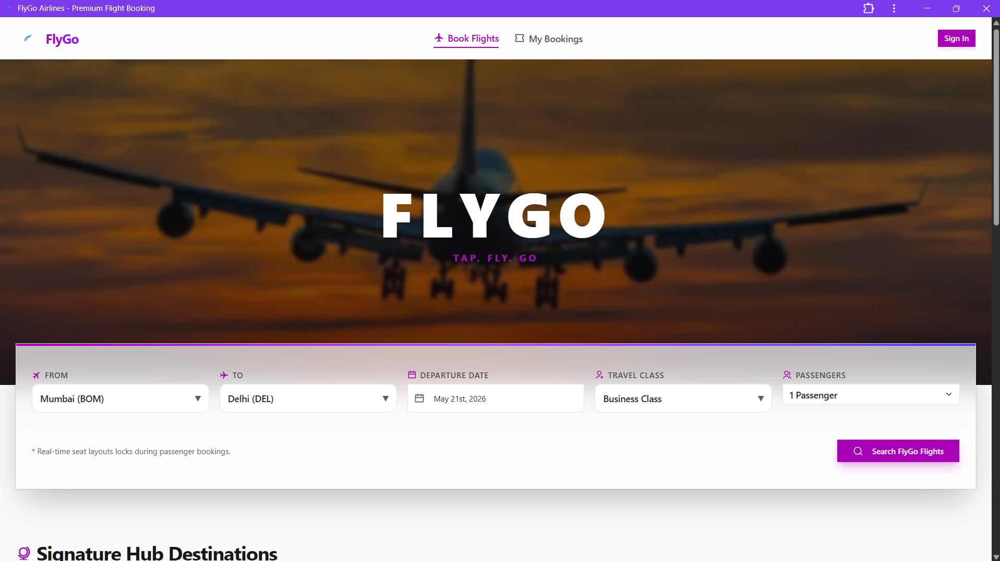
      </a>
      <br />
      <sub><em>Fly Go in standalone desktop window.</em></sub>
    </td>
  </tr>
</table>

### Supabase Row-Level Security (RLS)

<table width="100%">
  <tr>
    <td width="50%" align="center" valign="top">
      <strong>Flight access RLS policies</strong>
      <br />
      <a href="./screenshots/supabase_flight_rules.png" target="_blank">
        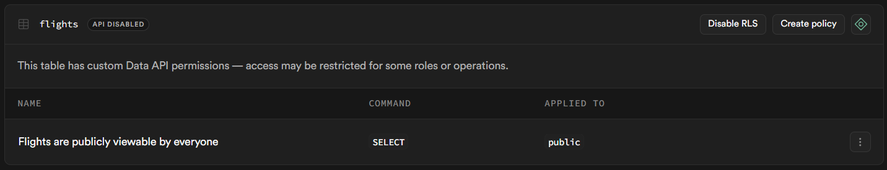
      </a>
      <br />
      <sub><em>Flight rules.</em></sub>
    </td>
    <td width="50%" align="center" valign="top">
      <strong>Seat selection RLS policies</strong>
      <br />
      <a href="./screenshots/supabase_seats_rule.png" target="_blank">
        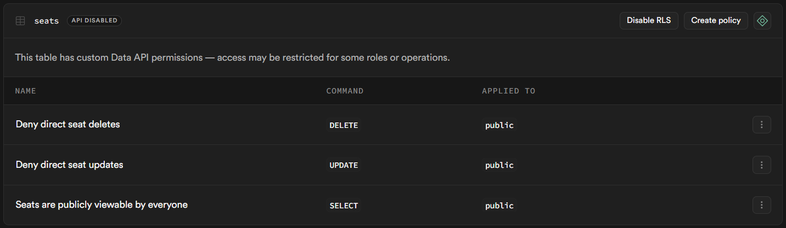
      </a>
      <br />
      <sub><em>Seat rules.</em></sub>
    </td>
  </tr>
  <tr>
    <td width="50%" align="center" valign="top">
      <strong>Booking RLS policies</strong>
      <br />
      <a href="./screenshots/supabase_booking_rules.png" target="_blank">
        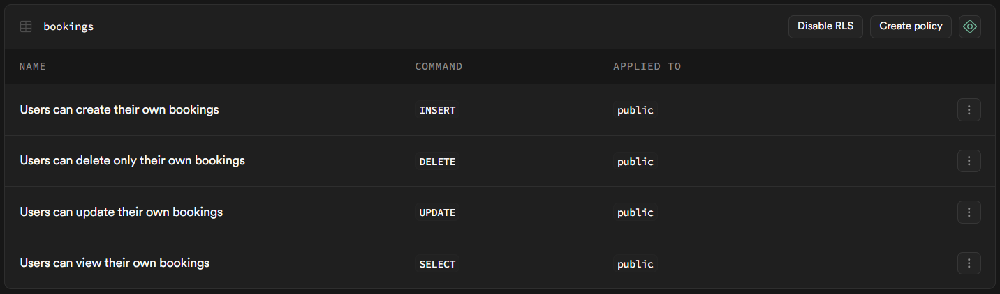
      </a>
      <br />
      <sub><em>Booking rules.</em></sub>
    </td>
    <td width="50%" align="center" valign="top">
      <strong>Passenger details RLS policies</strong>
      <br />
      <a href="./screenshots/supabase_passanger_rules.png" target="_blank">
        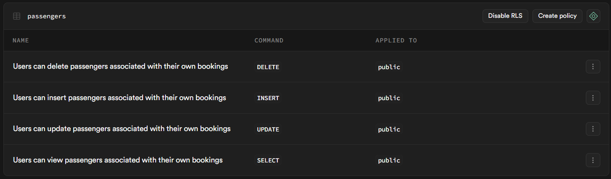
      </a>
      <br />
      <sub><em>Passenger rules.</em></sub>
    </td>
  </tr>
  <tr>
    <td colspan="2" align="center" valign="top">
      <div style="max-width: 50%;">
        <strong>Rescheduling log RLS policies</strong>
        <br />
        <a href="./screenshots/supabase_reschedule_rules.png" target="_blank">
          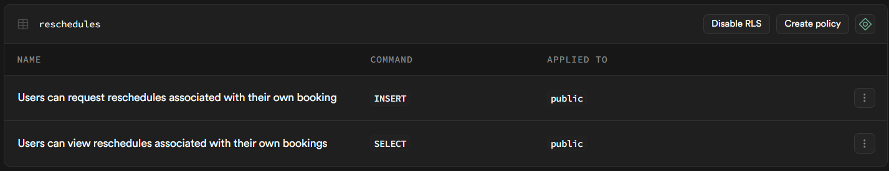
        </a>
        <br />
        <sub><em>Reschedule log rules.</em></sub>
      </div>
    </td>
  </tr>
</table>

---

## Lighthouse performance

Lighthouse scores from local performance tests:

<table width="100%">
  <tr>
    <td width="50%" align="center" valign="top">
      <strong>Desktop report</strong>
      <br />
      <a href="./screenshots/lightroom_score_navigation_desktop.png" target="_blank">
        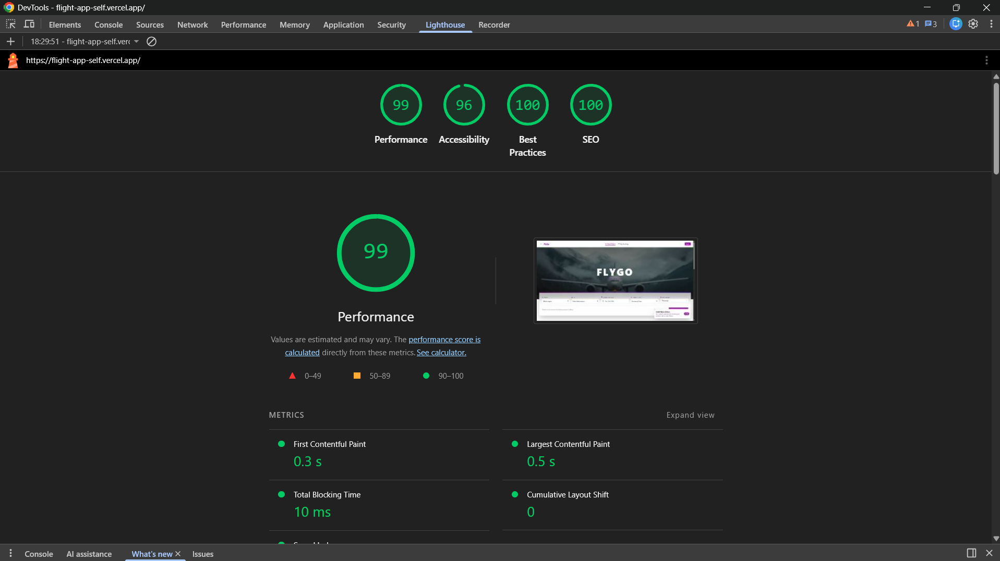
      </a>
      <br />
      <sub><em>100/100 across performance, accessibility, best practices, and SEO.</em></sub>
    </td>
    <td width="50%" align="center" valign="top">
      <strong>Mobile report</strong>
      <br />
      <a href="./screenshots/lightroom_score_navigation_mobile.png" target="_blank">
        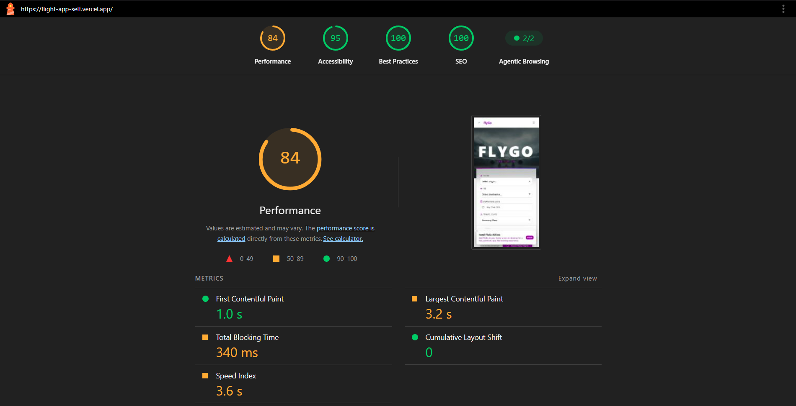
      </a>
      <br />
      <sub><em>Mobile results show excellent speed indexes and load times.</em></sub>
    </td>
  </tr>
</table>

Lighthouse recently removed the PWA category badge, but the app still fulfills all standard PWA requirements like install prompts and offline caching.
